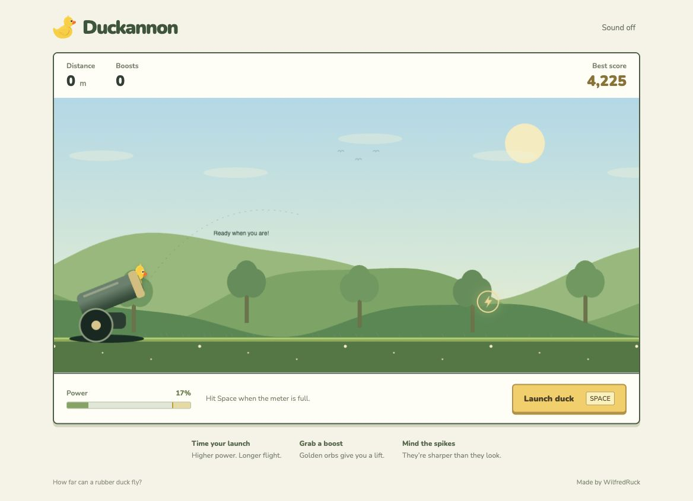

# Duckannon

Launch a rubber duck from a cannon, catch glowing boost orbs, and see how far you can fly. Time your launch for maximum power, bounce across the meadow, and avoid the spikes.

Duckannon is a browser arcade game built with JavaScript, HTML5 Canvas, and CSS. This version gives the original game a brighter meadow design, a clearer scoreboard, and a smoother play-and-retry loop.

## Preview



## Play locally

No build step or dependency installation is required. From the repository folder, run:

```sh
python3 -m http.server 8765 --bind 127.0.0.1
```

Open [Duckannon locally](http://127.0.0.1:8765/).

## Controls

- Press **Space** or select **Launch duck** to launch.
- Launch when the power meter reaches its yellow zone for a stronger shot.
- Collect golden orbs for a lift and **200 bonus points** each.
- Avoid spikes; hitting one ends the flight.
- Select **Try again** or press **Space** after a flight to reset.
- Select **Sound on** to enable audio. Orb pickups play a short chime.

Your final score combines distance and boost bonuses. Your best score is saved in the current browser using local storage.

## The original project

[The original Duckannon project](https://github.com/WilfredRuck/duck_cannon) was created by [WilfredRuck](https://github.com/WilfredRuck) as a JavaScript and HTML5 Canvas side-scroller. Players launched a rubber duck from a cannon and earned points for distance, with custom gravity, friction, bouncing, and collision detection. Bombs provided boosts, while spikes ended the run.

This update builds on that original idea and retains its rubber-duck artwork and launch-timing gameplay. The changes below refresh the presentation and play experience, including replacing bomb pickups with glowing orbs.

## What's new

- Cream-and-green interface with the game at the center.
- Layered meadow hills, trees, birds, and flowers with parallax scrolling.
- A custom cannon with the duck peeking out from inside the barrel before launch.
- A visible power meter, distance counter, boost total, and personal best.
- Glowing, single-use boost orbs and particle effects.
- A results screen with a quick retry button.
- Responsive layout and both keyboard and button controls.
- Frame-time-based animation and retuned flight physics.

## Project structure

- `index.html` — game layout and controls.
- `css/main.css` — responsive styling.
- `js/entry.js` — active game loop, physics, rendering, scoring, and audio.
- `images/` — original artwork, including the rubber duck.
- `audio/` — launch and duck sounds, plus the new orb chime.

The original JavaScript modules and Webpack configuration are preserved for reference. The current page loads `js/entry.js` directly as a browser module. Google Fonts supplies Nunito, with system font fallbacks.

## Author

Created by [WilfredRuck](https://github.com/WilfredRuck).

[Source repository](https://github.com/WilfredRuck/duck_cannon)
